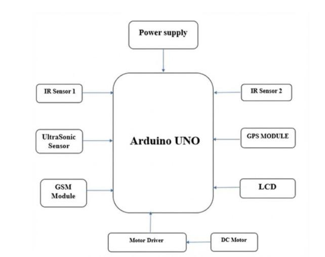
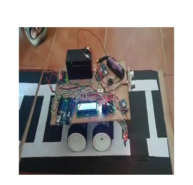
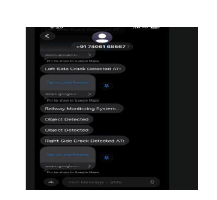
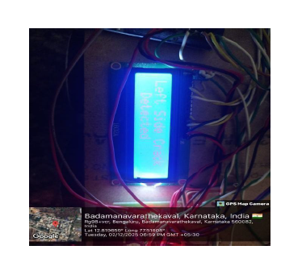
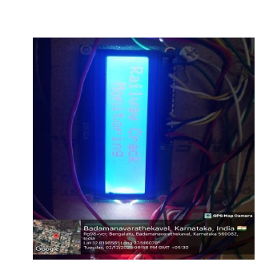

# 🚆 Train Track Crack Detection and Real-Time Accident Prevention System

# 📌 Project Overview

Railway transportation plays a crucial role in national connectivity and economic growth. However, railway tracks are subjected to continuous heavy loads, vibrations, temperature variations, and environmental stress, which gradually lead to cracks and structural defects. If these defects are not detected early, they may result in serious accidents such as derailments.

This project proposes an **automated, low-cost railway track crack detection system** using embedded systems and IoT technology. The system continuously monitors the railway track using IR and Ultrasonic sensors. When a crack or obstacle is detected, the system:

- Stops the motor immediately
- Captures the exact GPS location
- Sends an SMS alert using GSM module
- Displays fault information on LCD

The objective is to reduce manual inspection, improve detection accuracy, and enhance railway safety through automation.

---

# 🎯 Objectives

- To design an automated crack detection system using sensors.
- To provide real-time location tracking using GPS.
- To send immediate alerts to authorities using GSM communication.
- To develop a portable and cost-effective inspection prototype.

---

# 🛠 Hardware Components Used

### 🔹 Arduino UNO
Acts as the central controller. It processes sensor inputs and controls motors, GSM, GPS, and LCD.

### 🔹 IR Sensors (2)
Used for detecting surface cracks or discontinuities on railway tracks.

### 🔹 Ultrasonic Sensor
Measures distance and detects obstacles ahead of the rover.

### 🔹 GSM Module
Sends SMS alerts to predefined mobile numbers.

### 🔹 GPS Module
Provides real-time latitude and longitude coordinates of detected faults.

### 🔹 16×2 LCD Display
Displays system status, crack detection messages, and distance readings.

### 🔹 L293D Motor Driver
Controls DC motor direction and movement.

### 🔹 DC Motors
Provide movement to the inspection rover.

### 🔹 Lithium Battery
Provides portable power supply for field operation.

---

# ⚙ Working Principle

1. The rover moves along the railway track.
2. IR sensors continuously monitor track surface.
3. Ultrasonic sensor checks for obstacles ahead.
4. If crack or obstacle is detected:
   - Motor driver stops the vehicle immediately.
   - GPS captures current coordinates.
   - GSM sends SMS alert with Google Maps link.
   - LCD displays detection message.
5. System waits until fault condition is cleared.

This ensures real-time monitoring and rapid response.

---

# 📊 Block Diagram

The block diagram illustrates the interaction between sensors, Arduino controller, communication modules, and motor control system.

---

# 🚗 Project Prototype

The prototype consists of a wheeled inspection rover built on a stable base platform with all modules mounted securely.

---

# 📩 SMS Alert Output

When a crack is detected, an SMS alert is sent containing:
- Type of fault
- Google Maps location link

---

# 🔍 Crack Detection Output

The LCD displays messages such as:
- “Left Side Crack Detected”
- “Right Side Crack Detected”
- “Object Detected”

---

# 📈 Results

- Detection Range: 5 cm – 120 cm  
- GPS Accuracy: ±4–6 meters  
- SMS Delivery Time: 4–8 seconds  
- Battery Backup: ~3 hours continuous operation  

The system demonstrated stable and reliable performance during field testing.

---

# ⚠ Limitations

- Very narrow cracks may require camera-based detection.
- GPS accuracy may reduce in shaded areas.
- GSM depends on network signal strength.
- Mechanical stability needs improvement for real railway deployment.

---

# 🚀 Future Enhancements

- Integration of camera-based crack detection
- AI-based image processing
- Cloud-based monitoring dashboard
- Differential GPS for higher location accuracy
- Stronger industrial-grade mechanical chassis

---

# 📄 Full Project Report

The complete detailed report is available inside the `/Report` folder of this repository.

---

# 🏆 Conclusion

The developed system successfully demonstrates a low-cost, automated solution for railway track monitoring. By integrating sensing, communication, and embedded control technologies, the project enhances railway safety and reduces dependency on manual inspection methods.

This system can be further upgraded and scaled for real-world railway infrastructure monitoring applications.

---
---

## 👨‍💻 Team Members

- Deepak B C (1DT23EC020)  
- Likhith D K (1DT23EC049)  
- Mallikarjun S G (1DT23EC053)  
- Hithesh K R (1DT24EC403)  

**Department of Electronics & Communication Engineering**  
Dayananda Sagar Academy of Technology and Management  
Academic Year: 2025–2026  

---
